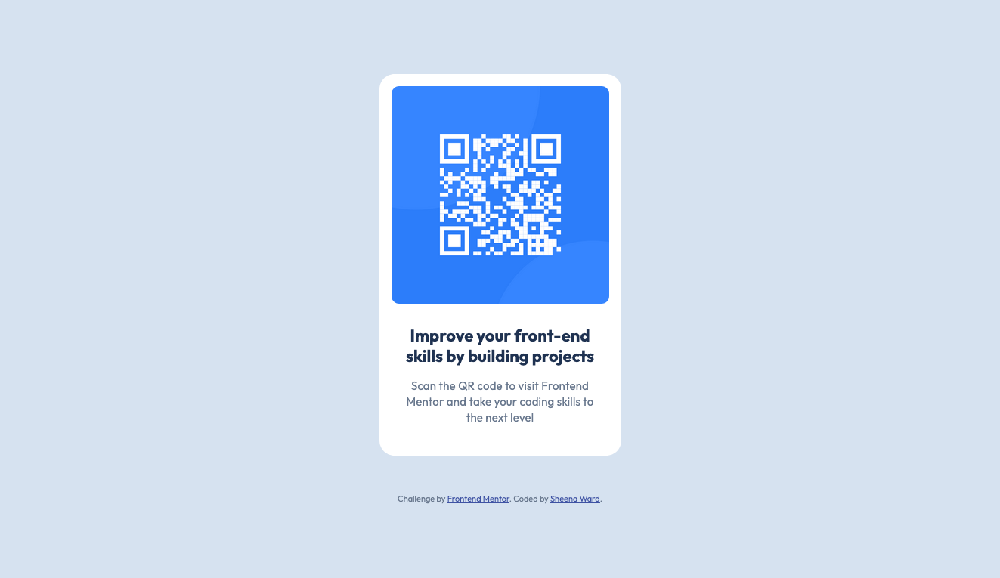

# Frontend Mentor - QR code component solution

This is a solution to the [QR code component challenge on Frontend Mentor](https://www.frontendmentor.io/challenges/qr-code-component-iux_sIO_H). Frontend Mentor challenges help you improve your coding skills by building realistic projects. 

## Table of contents

- [Overview](#overview)
  - [Screenshot](#screenshot)
  - [Links](#links)
- [My process](#my-process)
  - [Built with](#built-with)
  - [What I learned](#what-i-learned)
  - [Continued development](#continued-development)
- [Author](#author)

**Note: Delete this note and update the table of contents based on what sections you keep.**

## Overview

### Screenshot

### Links

- Solution URL: [Add solution URL here](https://your-solution-url.com)
- Live Site URL: [Add live site URL here](https://your-live-site-url.com)

## My process

### Built with

- Semantic HTML5 markup
- CSS
- Flexbox

### What I learned

This was my first time working with a Figma design file and a style guide. I learned what they are used for and how I can use these in my work as a front-end developer. I took the time to organize my thoughts and think about how I would approach the design.

### Continued development

I want to continue learning how best to utilise flex box in my designs and I also want to learn more about mobile-first design. I also need to improve my entire thought process and organization.

## Author

- Frontend Mentor - [@sheenaxiv](https://www.frontendmentor.io/profile/sheenaxiv)
- GitHub - [@sheenaxiv](https://github.com/sheenaxiv)
- Bluesky - [@sheenaxiv](https://bsky.app/profile/sheenaxiv.bsky.social)
